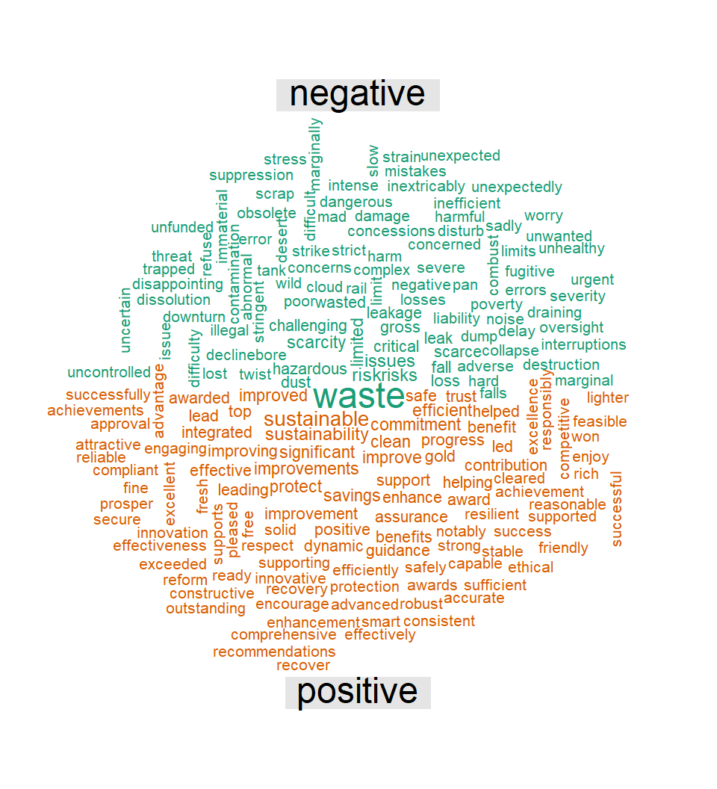

Analyzing Text Data
================
Furqan Shah
2024-10-09

# Introduction

In this tutorial, we will apply some basic textual analysis on data
extracted from 23 companies’ annual reports (provided on the repository
for this page). The example data used is self-annotated, where
narratives are classified into the following categories for each company
annual report: Financial, Human, Intellectual, Natural, Social &
Relationship, Manufactured, and an Unclassified category. This
classification helps us explore different aspects of the companies’
reports and analyze how they communicate various types of information. I
will go through basic textual analysis tasks including cleaning,
tokenizing, analyzing, and visualizing text data.

## Step 1: Load and Install Required Libraries

Before proceeding, we need to ensure that the necessary packages are
installed.

``` r
# Function to install a package if not already installed
install_if_missing <- function(pkg) {
  if (!require(pkg, character.only = TRUE)) {
    install.packages(pkg, dependencies = TRUE)
    library(pkg, character.only = TRUE)
  }
}

# Load required packages and install if necessary
packages <- c("dplyr", "tidyr", "stringr", "tidytext", "ggplot2", "reshape2", "wordcloud2", "textdata", "wordcloud")

invisible(lapply(packages, install_if_missing))
```

## Step 2: Prepare and Load the Data

The data consists of 23 separate `.tsv` files, each representing a
different company. Each file contains two columns: `Text` (which holds
sentences or paragraphs) and `Theme` (the category assigned to the
text). The categories in `Theme` column includee: **Financial**,
**Human**, **Intellectual**, **Natural**, **Social & Relationship**, and
**Unclassified**, as defined below:

- **Financial**: *Information about the company’s financial performance,
  including revenue, expenses, profits, and financial health.*
- **Human**: *Relates to employees, their well-being, skills, and
  workforce management.*
- **Intellectual**: *Covers intangible assets like patents, trademarks,
  and the company’s innovation capacity.*
- **Natural**: *Focuses on environmental sustainability, resource usage,
  and the company’s ecological impact.*
- **Social & Relationship**: *Refers to the company’s interactions with
  stakeholders, including communities, customers, and regulators.*
- **Manufactured**: *Involves physical assets such as infrastructure,
  equipment, and operational capacity.*
- **Unclassified**: *Includes disclosures that do not fit into the other
  categories.*

``` r
# List and read TSV files, add source column, combine, and remove missing rows/observations

# you need to replace path where to where you have stored the 23 .tsv files
path <- "F:/Github Projects/exploring-text-data/data files" 

data <- list.files(path = path, pattern = "\\.tsv$", full.names = TRUE) %>%
  lapply(function(file) read.delim(file) %>% mutate(source_file = basename(file))) %>%
  bind_rows() %>%
  rename(text = Text,
         theme = Theme,
         source = source_file) %>%
  mutate(across(everything(), ~na_if(str_trim(.), ""))) %>%
  drop_na()

glimpse(data)
```

    ## Rows: 9,711
    ## Columns: 3
    ## $ text   <chr> "Notably, our production performance in all our key businesses …
    ## $ theme  <chr> "Unclassified", "Unclassified", "Human", "Human", "Intellectual…
    ## $ source <chr> "2014_angloamerican.tsv", "2014_angloamerican.tsv", "2014_anglo…

``` r
data %>% count(source) # number of source files (should be 23)
```

    ##                      source   n
    ## 1    2014_angloamerican.tsv 444
    ## 2       2014_baesystems.tsv 482
    ## 3              2014_bat.tsv 498
    ## 4      2014_britishland.tsv 330
    ## 5          2014_btgroup.tsv 511
    ## 6         2014_cocacola.tsv 446
    ## 7            2014_crest.tsv 307
    ## 8           2014_diageo.tsv 574
    ## 9        2014_fresnillo.tsv 693
    ## 10             2014_gog.tsv 392
    ## 11        2014_halfords.tsv 438
    ## 12       2014_hammerson.tsv 422
    ## 13          2014_howden.tsv 208
    ## 14            2014_hsbc.tsv 420
    ## 15             2014_ihg.tsv 485
    ## 16          2014_lloyds.tsv 297
    ## 17   2014_marksnspencer.tsv 302
    ## 18      2014_mediclinic.tsv 592
    ## 19           2014_mondi.tsv 318
    ## 20            2014_sage.tsv 504
    ## 21        2014_unilever.tsv 375
    ## 22 2014_unitedutilities.tsv 368
    ## 23        2014_vodafone.tsv 305

``` r
data %>% count(theme) # number of categories assigned to text  
```

    ##                 theme    n
    ## 1           Financial 1851
    ## 2               Human  704
    ## 3        Intellectual 1590
    ## 4        Manufactured  501
    ## 5             Natural  575
    ## 6 Social_Relationship 1929
    ## 7        Unclassified 2561

## Step 3: Clean and Prepare Text Data for Analysis

We will clean the text data in the `text` column by removing special
characters, inserting spaces between words and numbers where needed, and
eliminating any extra whitespace.

``` r
# Clean data
data2 <- data %>%
  mutate(text = str_replace_all(text, "[?âè.ã'’'½_&$,%'-']", " "), # Remove special characters
         text = str_replace_all(text, "([0-9])([a-z])", "\\1 \\2"),  # Add space between numbers and letters
         text = str_replace_all(text, "([a-z])([0-9])", "\\1 \\2"),  # Add space between letters and numbers
         text = str_squish(text))                                   # Strip extra white space
                                   
glimpse(data2)
```

    ## Rows: 9,711
    ## Columns: 3
    ## $ text   <chr> "Notably our production performance in all our key businesses h…
    ## $ theme  <chr> "Unclassified", "Unclassified", "Human", "Human", "Intellectual…
    ## $ source <chr> "2014_angloamerican.tsv", "2014_angloamerican.tsv", "2014_anglo…

Now we prepare the data for analysis by tokenizing the text. This means
each sentence or paragraph in the `text` column is broken down into
individual words, with each word becoming its own row. The following
code performs this tokenization:

``` r
# Tidy data - Unnest tokens
tidy_data <- data2 %>%
  unnest_tokens(word, text) %>%
  anti_join(stop_words) %>%                 # remove stop words          
  mutate(characters = nchar(word)) %>%      # number of alphabets in a word
  filter(characters > 1)                # filtering for words with > 1 alphabets
```

    ## Joining with `by = join_by(word)`

``` r
glimpse(tidy_data)
```

    ## Rows: 277,378
    ## Columns: 4
    ## $ theme      <chr> "Unclassified", "Unclassified", "Unclassified", "Unclassifi…
    ## $ source     <chr> "2014_angloamerican.tsv", "2014_angloamerican.tsv", "2014_a…
    ## $ word       <chr> "notably", "production", "performance", "key", "businesses"…
    ## $ characters <int> 7, 10, 11, 3, 10, 5, 4, 7, 4, 4, 3, 5, 3, 7, 8, 7, 7, 6, 7,…

Notice the difference between the outputs of glimpse(data2) and
glimpse(tidy_data). The previous code tokenized the text column,
transforming each observation into individual words, allowing us to
perform further analysis on a word-by-word basis.

## Step 4: Analyze and Visualize Text Data

### Top 15 Words

Next, we count the frequency of words used in each narrative reporting
category. Then, we select the top 15 most frequent words for each
category.

``` r
# Top 15 words 
top15_tidy <- tidy_data %>%
  count(word, theme, source) %>%
  filter(!str_detect(word, "^[0-9]*$")) %>%           # Exclude words that are just numbers
  count(word, theme) %>%
  group_by(theme) %>%
  slice_max(n, n = 15, with_ties = FALSE) %>%         # Select exactly top 10 words per theme
  ungroup() %>%
  arrange(theme, desc(n), word)                       # Arrange by theme, frequency, and word

glimpse(top15_tidy)
```

    ## Rows: 105
    ## Columns: 3
    ## $ word  <chr> "business", "cash", "continued", "cost", "impact", "increase", "…
    ## $ theme <chr> "Financial", "Financial", "Financial", "Financial", "Financial",…
    ## $ n     <int> 23, 23, 23, 23, 23, 23, 23, 23, 23, 23, 22, 22, 22, 22, 22, 23, …

Now we use `ggplot` to visualize the top 15 most frequent words for each
reporting category.

``` r
# Visualize top 15 words for each category
top15_tidy_plot <- top15_tidy %>%
  mutate(word = reorder(word, n)) %>%
  ggplot(aes(word, n)) +
  geom_col () +
  labs(x = NULL, y = "n") +
  facet_wrap(~theme, ncol = 2, scales = "free") +
  coord_flip()
top15_tidy_plot
```

<!-- -->

We can see that the top 15 words for each category align with
expectations. For example, words like *energy*, *emissions*, *carbon*,
*environmental*, and *greenhouse* appear frequently in the **Natural**
category, reflecting the focus on environmental topics.

### Word Cloud for “Natural” Category

One may also create a word cloud for a specific reporting category.
Below, we generate a word cloud for the **Natural** reporting category.

``` r
# World cloud - Natural 
theme_data <- tidy_data %>%
  filter(theme == "Natural") %>%              # You can replace "Natural" with any other category, e.g., "Human"
  filter(!str_detect(word, "^[0-9]*$")) %>%   # Remove words that are just numbers
  count(word) %>%
  arrange(desc(n))
  
wordcloud(words = theme_data$word, freq = theme_data$n, 
          scale = c(2, 0.5), random.order = FALSE, max.words = 200,
          colors = brewer.pal(8, "Dark2"))
```

<!-- -->

### Word Cloud for “Natural” Category - Words Separated by Tone (Positive vs. Negative)

Below, we generate a word cloud for the **Natural** category, with words
separated by tone (positive vs. negative).

``` r
# Positive and Negative Tone Word Cloud
tidy_data %>%
  filter(theme == "Natural") %>%
  inner_join(get_sentiments("bing")) %>%
  count(word, sentiment, sort = TRUE) %>%
  acast(word ~ sentiment, value.var = "n", fill = 0) %>%
  comparison.cloud(max.words = 200, title.size = 3, scale = c(3, 1.3))
```

    ## Joining with `by = join_by(word)`

<!-- -->

## Conclusion

In this tutorial, I demonstrate how to conduct basic text data analysis
using a dataset of 23 companies’ annual reports, with narratives
classified in different reporting themes. The focus was on cleaning,
tokenizing, and visualizing the text. By following these steps, one can
apply similar techniques to other textual datasets or any form of
unstructured text data to extract insights.
